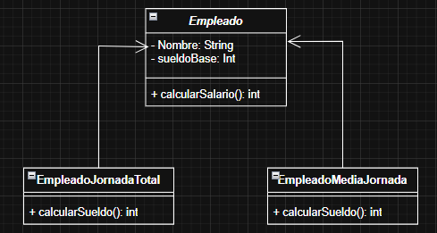

## Diagrama correspondiente al ejercicio.

## Arrancar el proyecto en TypeScript

### 1. Inicializar el proyecto

Ejecutar con Node:

- npm install -g typescript
- tsc empleados.ts (nombre del archivo)
- node empleados.js

Ejecutar con ts-node:

- npm install -g ts-node typescript
- ts-node empleados.ts (nombre del archivo)

