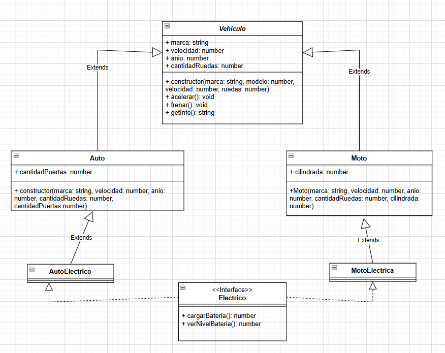

## Diagrama correspondiente al ejercicio.
## Este proyecto implementa un sistema de clases en TypeScript.

## Arrancar el proyecto en TypeScript

### 1. Inicializar el proyecto

- npm init -y

### 2. Instalar dependencias 

- npm i typescript -D
- npm i @types/node -D
- npm i ts-node -D

### Compilar el proyecto

- npx tsc

### Ejecutar

- node dist/index.js

*En lugar de compilar y luego correr con Node, se puede ejecutar directamente el .ts*

- npx ts-node src/index.ts

