# TP2 - API de Pizzería

Mini‑proyecto (punto 5): API REST con Express + TypeScript, validaciones con Zod, TDD con Jest (tests unitarios e integracion).

## Requisitos
- Node.js 18+ 
- npm 9+

## Instalación
```bash
npm install
```

## Scripts
- `npm run dev`: inicia el servidor en desarrollo con recarga en caliente (puerto 3000)
- `npm run build`: compila TypeScript a `dist/`
- `npm start`: ejecuta el build (`node dist/server.js`)
- `npm test`: ejecuta tests
- `npm run test:watch`: ejecuta tests en modo watch
- `npm run test:coverage`: reporte de cobertura

## Endpoints
Base URL: `http://localhost:3000`

1) Crear pedido
- Method: POST
- URL: `/`
- Body:
```json
{
  "items": [
    { "tamanio": "M", "toppings": ["queso", "jamon"] }
  ],
  "direccion": "11 de Abril 461, Bahia Blanca"
}
```
- Respuestas:
  - 201 creadoEn: retorna `Orden` con `id`, `precioTotal`, `estado`, etc.
  - 422 Unprocessable Entity: validación fallida

2) Obtener pedido por id
- Method: GET
- URL: `/:id`
- Respuestas:
  - 200 OK: retorna el pedido
  - 404 Not Found: si no existe

3) Cancelar pedido
- Method: POST
- URL: `/:id/cancel`
- Reglas: no se puede cancelar si `estado = entregado`
- Respuestas:
  - 200 OK: retorna el pedido con `estado = cancelado` y un mensaje: "Orden cancelada exitosamente"
  - 404 Not Found: si no existe
  - 409 Conflict: si es que intentan cancelar un pedido entregado

4) Listar pedidos
- Method: GET
- URL: `/?estado=<pendiente | preparado | entregado | cancelado>`
- Respuestas:
  - 200 OK: array de pedidos
  - 422 Unprocessable Entity: si `estado` invalido

## Reglas de negocio
- `tamanio ∈ {S, M, L}`
- Max. 5 `toppings` por item
- Precio = base por tamaño + 1500 por topping
  - S: 10000
  - M: 14500
  - L: 18000
- No se puede cancelar si `estado = entregado`

## Validaciones (Zod)
- `items[]` no vacío
- `direccion` con mínimo 10 caracteres
- `tamanio` válido, `toppings` array de strings, máx 5

## Ejemplos curl

Crear pedido (201):
```bash
curl -X POST http://localhost:3000/ \
  -H "Content-Type: application/json" \
  -d '{
    "items": [{"tamanio": "M", "toppings": ["queso", "jamón"]}],
    "direccion": "Calle Falsa 123, Springfield"
  }'
```

Crear invalido (422 por items vacío):
```bash
curl -X POST http://localhost:3000/ \
  -H "Content-Type: application/json" \
  -d '{
    "items": [],
    "direccion": "Calle Falsa 123"
  }'
```

Obtener por id (200/404):
```bash
# suponiendo id=order-1
curl http://localhost:3000/order-1
```

Cancelar pedido (200/409/404):
```bash
curl -X POST http://localhost:3000/order-1/cancel
```

Listar todos (200):
```bash
curl http://localhost:3000/
```

Filtrar por estado (200):
```bash
curl "http://localhost:3000/?estado=pendiente"
```

# Matriz de Casos de Prueba
| **ID | **Caso/Descripcion** | **Precondicion** | **Input** | **Accion** | **Resultado esperado** | **Test** |
|--------------|----------------|------------------|------------|-------------|--------------------------|-----------|
| **CA1** | Crear pedido valido | Servidor iniciado | `{ "items": [{"tamanio": "M", "toppings": ["queso", "jamon"]}], "direccion": "Yrigoyen 585, Bahia Blanca" }` | Enviar POST `/` | Pedido creado con `estado: "pendiente"`, `id`, y `precioTotal=17500` | verde |
| **CA2** | Crear pedido con lista de items vacia | Servidor iniciado | `{ "items": [], "direccion": "Yrigoyen 585" }` | Enviar POST `/` | Error de validacion “items no puede estar vacio” | verde |
| **CA3** | Crear pedido con direccion corta | Servidor iniciado | `{ "items": [{"tamanio":"S","toppings":["queso"]}], "direccion":"Yri 585"}` | Enviar POST `/` | Error de validacion “direccion debe tener minimo 10 caracteres” | verde |
| **CA4** | Obtener pedido existente | Pedido creado previamente con id=order-1 | `GET /orden-1` | Enviar GET `/orden-1` | Devuelve pedido con informacion completa | verde |
| **CA5** | Obtener pedido inexistente | No existe pedido con id=order-999 | `GET /orden-999` | Enviar GET `/orden-999` | Error “Pedido no encontrado” | verde |
| **CA6** | Cancelar pedido pendiente | Pedido con `estado=pendiente` existente | `POST /orden-1/cancel` | Enviar POST `/orden-1/cancel` | Pedido actualizado a `estado=cancelado` | verde |
| **CA7** | Cancelar pedido entregado | Pedido con `estado=entregado` existente | `POST /orden-2/cancel` | Enviar POST `/orden-2/cancel` | Error de negocio “No se puede cancelar pedido entregado” | verde |
| **CA8** | Listar todos los pedidos | Base con pedidos creados | `GET /` | Enviar GET `/` | Devuelve arreglo de todos los pedidos | verde |
| **CA9** | Filtrar pedidos por estado valido | Base con pedidos de distintos estados | `GET /?estado=pendiente` | Enviar GET `/` con query `estado=pendiente` | Devuelve solo pedidos pendientes | verde |


## Ciclo TDD - Test Unitarios - Reglas de negocio

---
**Crear orden**
---
*Test Rojo* - Hacemos el test y la funcion no existia
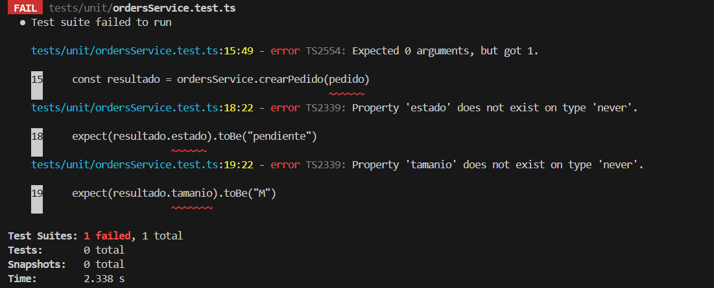
*Test Verde - Implementacion minima* - Calculamos base + toppings * precioToppings
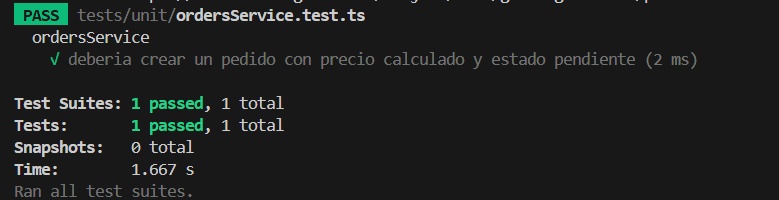
*Refactorizacion* - nombres claros,  constantes claras.
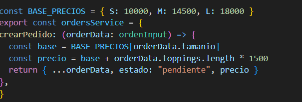

---

**Maximo 5 toppings**
---
*Test Rojo* - hacemos el test, no existe la logica
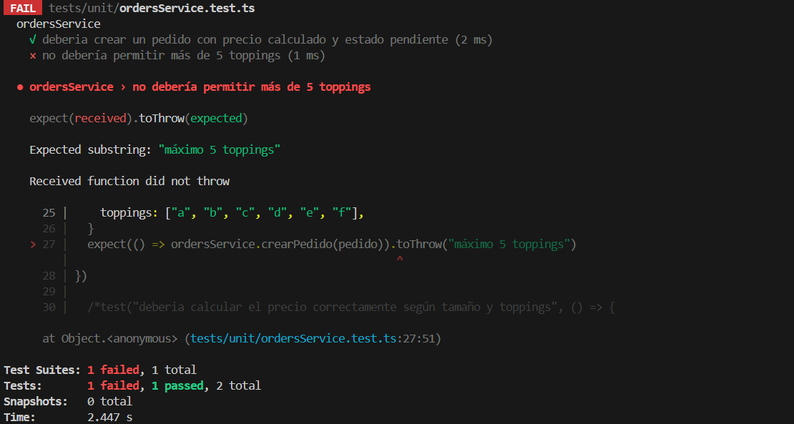
*Test Verde - Implemetacion minima* agregamos funcion, si es mayor que 5 topping que largue un error

*Refactorizacion* - funcion implementada, llamada a la funcion. Codigo mas limpio
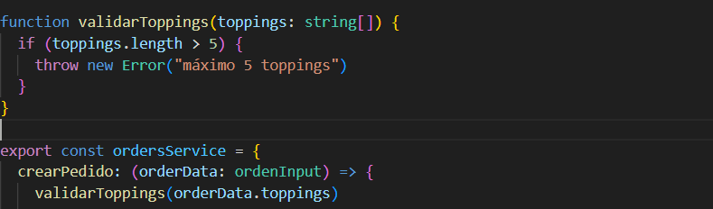

**No calcelar si estado=entregado**
---
*Test Rojo* - hacemos el test, no existe la funcion
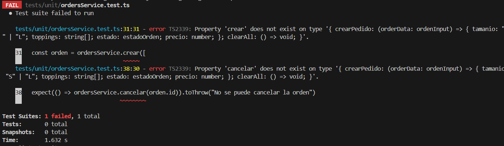
*Test Verde - Implemetacion minima* - creamos funcion, que no se pueda cancelar
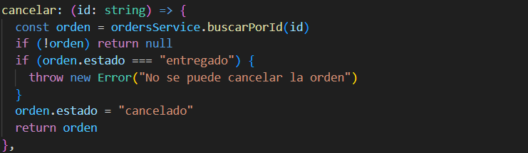
*Refactorizacion* - nombramos variables, separacion de logica
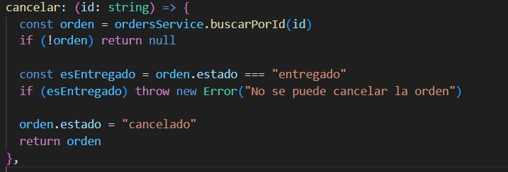

---

**Cancelar pendiente**
---

*Test Rojo* - hacemos el test con expectativa, no hay logica alguna
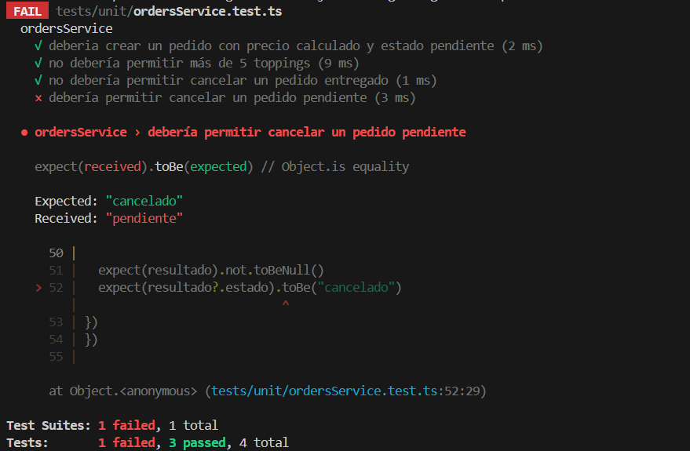
*Test Verde - Implementacion* - hacer orden.estado = cancelado
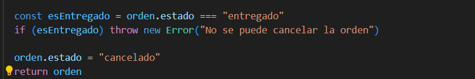

## Test Integracion - contrato HTTP
---

**Post - Crear pedido**
---
*Test Rojo* - ruta sin implementar
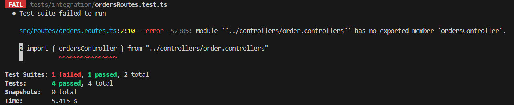
*Test Verde - Implementacion minima* - se usa ordersService.crear() sin validaciones
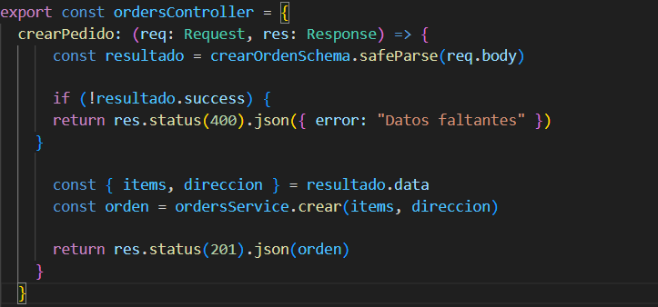
*Refactorizacion* - se remplazan las validaciones manuales por Zod, se centraliza la logica
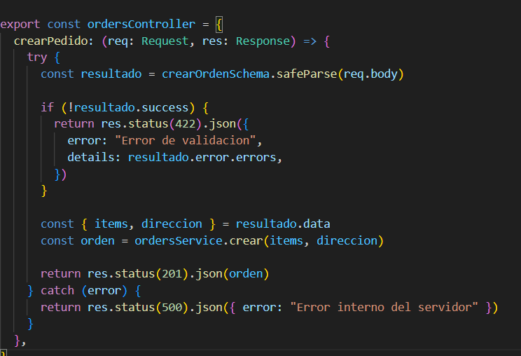

--- 

**Get - obtener pedido por ID**
---
*Test rojo* - ruta sin implementar o devuelve 501
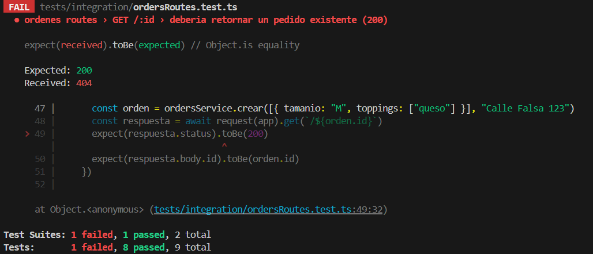
*Test Verde - Implementacion minma* - se usa ordersService.buscarPorId(id) y se retorna 200 o 404
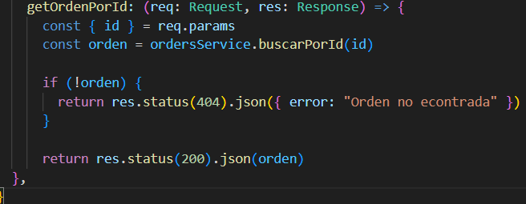
*Refactorizacion* - se agrega try/catch y mensajes de error con el resto de controladores

---

**Post - cancelar pedido**
---
*Test Rojo* - ruta no implemetnada
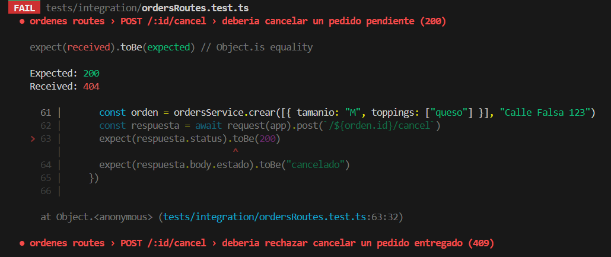
*Test verde - Implementacion minima* - se usa ordersService.cancelar(id) y retorna 200 si fue cancelado

*Refactorizacion* - se maneja el error, no se puede cancelar la orden, devolviendo 409 y un mensaje "Orden cancelada exitosamente"
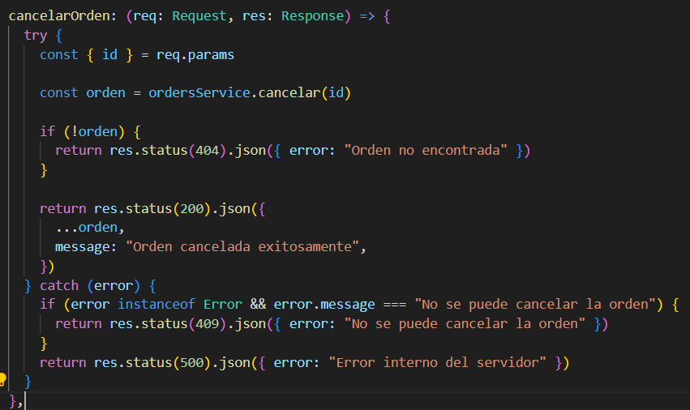

---

**Get - Listar pedidos / filtrar por estado**
---
*Test rojo* - ruta no implementada
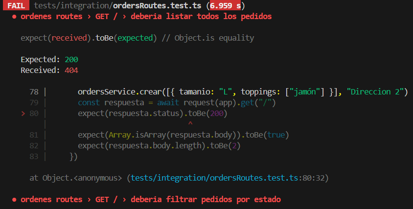
*Test verde - minima implementacion* - se retorna ordersService.buscarTodos() para listar pedidos
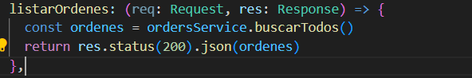
*Refactorizacion* - se valida el parámetro estado con Zod y se controla el manejo de errores
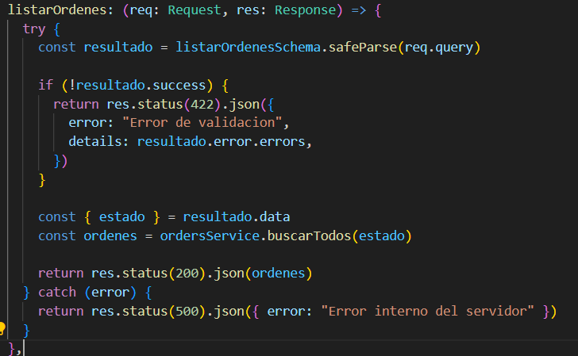


---

Umbral global configurado en `jest.config.js` (80% líneas/funciones/branches/statements).

