## TP3 - Cafeteria (TDD con React + Vitest + MSW)
---

## Objetivo Central
- Aplicar Desarrollo Guiado por Pruebas (TDD) en React para construir una pequeña
aplicación que simule el flujo de pedidos en una cafetería. El estudiante deberá
demostrar dominio del ciclo Rojo → Verde → Refactor , el uso de React Testing Library
(RTL) con consultas accesibles, el manejo de estado y la integración con una API
simulada mediante MSW .
---

## Stack Tecnológico
- React + TypeScript + Vite
- Vitest + React Testing Library + @testing-library/user-event
- MSW (Mock Service Worker)
- Zod para validaciones
- Context API o hooks personalizados para el estado global
---

## Contexto del Proyecto.
- Una cafetería desea digitalizar el proceso de toma de pedidos. El sistema mostrará un
menú de productos , permitirá agregar ítems a un pedido , visualizar el total a pagar , y
enviar el pedido (simulado). El objetivo del trabajo es implementar progresivamente
cada funcionalidad siguiendo la metodología TDD , escribiendo primero los tests y
luego la mínima implementación que los haga pasar.
---

## Configuracion del entorno
1. Crear proyecto base
   -  npm create vite@latest cafeteria -- --template react-ts
2. Intalar dependencias
   - npm install vitest @testing-library/react @testing-library/jest-dom @testing-library/user-event msw zod
3. Configurar Vitest en vitest.config.ts
   - test: {
  globals: true,
  environment: 'jsdom',
  setupFiles: './src/setupTests.ts',
},
4. Crear src/setupTests.ts para registrar MSW y jest-dom.

---

## TDD - Casos HU1, HU2, HU3, HU4, HU5, HU6.
---
HU1 - Visualizacion inicial del menu

- *Test rojo* - test que verifique que se muestran productos mockeados por la API (
screen.getByText('Café') ).
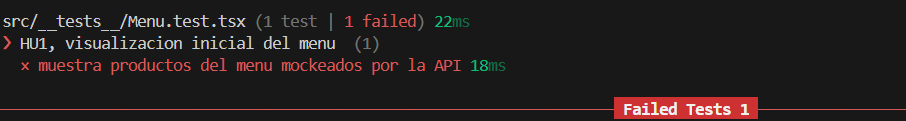

- *Test verde* - implementar fetch a /api/menu (interceptado por MSW).
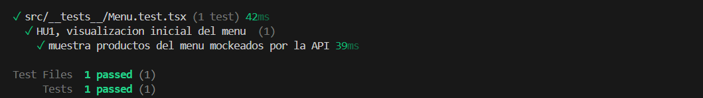

- *Refactor* - separar el componente <Menu /> .
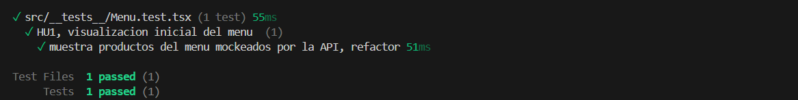

---
HU2 - Agregar ítem al pedido

- *Test* - simular click sobre el botón “Agregar” de un producto.
- 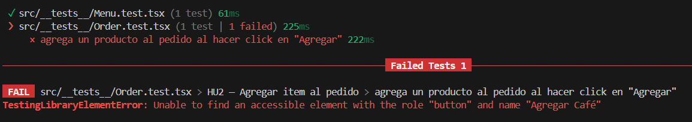

- *Verificacion* - Aparece en el área de pedido ( getByRole('list') ).
- *Implementacion* - Estado local o contexto ( useOrder ).
- 

---
HU3 - Calcular total del pedido

- *Test* - agregar varios productos y verificar el texto "Total: $..." .
- 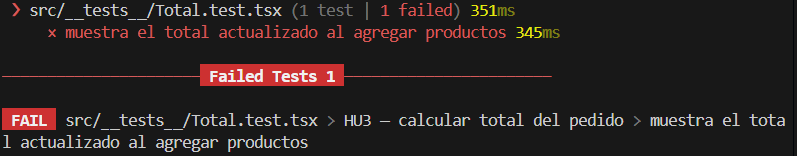

- *Implementacion* - Implementar cálculo dinámico.
- *Verificacion* -  Validar con expect(screen.getByText(/total:
\$\d+/i)).toBeInTheDocument() .
- 

---
HU4 - Eliminar ítem del pedido

- *Test* - verificar que el clic en “Eliminar” remueve solo ese producto.
- 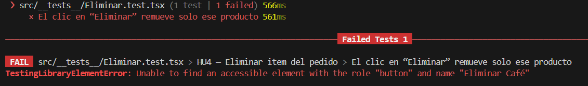

- *Implementacion* - Implementar e.stopPropagation() si se anidan botones.
- *Usar* - setState funcional.
- 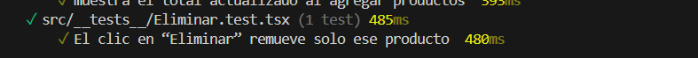

---
HU5 -  Enviar pedido (MSW + Contexto) - Mockear endpoint /api/orders con MSW .

*Test*
1. Agregar varios ítems.
2. Click en “Enviar pedido”.
3. Esperar await waitFor(...) que muestre mensaje “Pedido confirmado”.
- 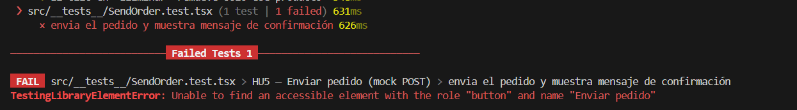

*Implementacion* - Implementar envío y limpiar estado tras éxito.
- 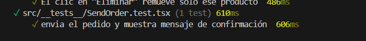

---
HU6 -  Caso límite: error o menú vacío

- *Test* -  Usar server.use() para simular un error 500 o lista vacía.
- 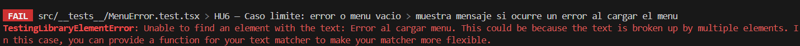
- 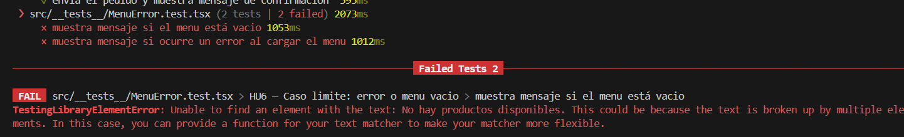 
  
- *Implementacion* - Verificar que la app muestre “No hay productos disponibles” o “Error al cargar
menú”
- 
- 
---

## Integracion completa
1- Cargar menú (mock).
2- Agregar ítems.
3- Calcular total.
4- Enviar pedido (mock POST).
5-Resetear interfaz.

- 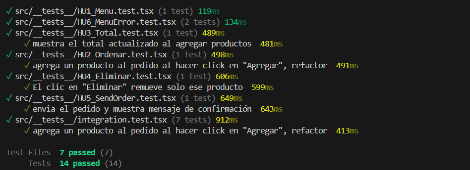

## Como ejecutar el proyeco
- git clone https://github.com/belenburgos20/Programacion_4
- cd TP3/cafeteria
- npm install
- npm run dev
  
---
## Ejecutar tests
- npx vitest run
